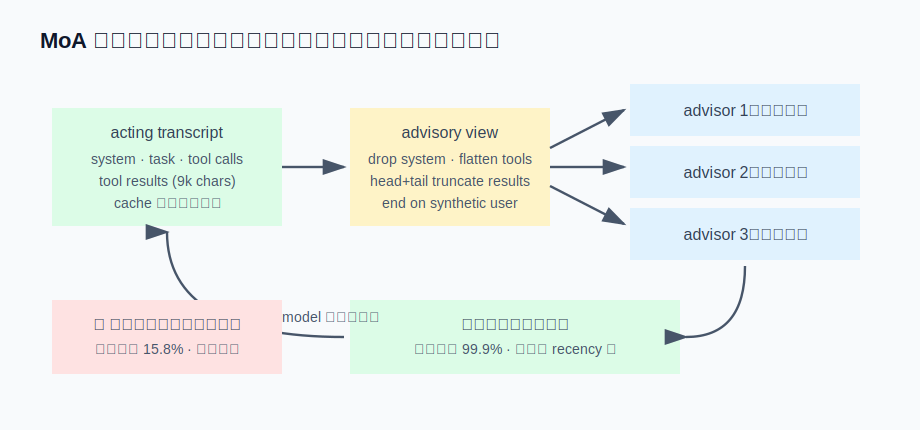

# s16 · MoA 多模型合议

MoA（Mixture-of-Agents）的原始形态：同一个问题发给 N 个参考模型（reference），再让一个
聚合模型（aggregator）综合它们的答案——一次问答、一次 fan-out、一次综合，在推理 benchmark
上确实能提升成绩。由此产生一个自然的想法：coding agent 的每一步决策也是"一个问题"，
能否给 acting model 配一组多模型顾问，每步都合议一次？

技术上可行。但一进工具循环，三笔原始 MoA 里不存在的成本就出现了：**顾问看什么**（对话里有
工具调用和兆级工具结果，不能原样转发）、**建议放哪**（位置不当会导致 prompt cache 前缀整段失效）、
**跑多勤**（每步 fan-out 是账单乘法器）。本章逐笔核算这三项成本。本章的"真实产品对照"
与以往不同：结论是评估之后，决定不做。



## 运行演示（不需要 API key）

```sh
node s16_moa/demo.mjs
```

三笔账，真实运行输出：

```
━━━ 账一：顾问的咨询视图（扁平化） ━━━
  完整 transcript：14 条消息（含 system/tool 角色）· 62615 字符
  咨询视图　　　：8 条消息（只有 user/assistant）· 25228 字符
  末尾角色：user ✅（不补这条合成 user，Anthropic 直接 400）
  工具轨迹保留：6/6 · 工具结果截断：9000 → ≤4000 字符

━━━ 账二：建议注入位置 vs prompt cache 前缀 ━━━
  合并进任务 user 消息（前部）：迭代间前缀复用 15.8% ❌ 建议每步都变 → 任务消息每步都变 → 后面全价重算
  追加在消息末尾（尾部）　　　：迭代间前缀复用 99.9% ✅ 只重算新增部分

━━━ 账三：fan-out 节奏 ×（3 个顾问 · 6 次工具迭代，计费输入 token） ━━━
  单模型（没有 MoA）　　　　　　　　：  20412 tok · 1.0×
  每步问顾问团 · 顾问不打 cache 标记：  88620 tok · 4.3×
  每步问顾问团 · 顾问也吃缓存　　　：  44472 tok · 2.2×
  每个 user turn 只问一次（user_turn）：  23994 tok · 1.2×
```

3 个顾问、6 次工具迭代，最直觉的实现（每步 fan-out、忘打缓存标记）是 **4.3 倍账单**——而且
这只是输入侧；顾问的输出（生成）才是延迟大头，后文详述。

## 设计：三个关键决定

### ① 顾问是参谋，不是替身：咨询视图要专门扁平化

顾问没有工具，也不能收到 `tool` 角色消息——strict provider（Mistral / Fireworks）看到一条
自己没发起过的 tool 消息直接 400。所以顾问看的是一份**扁平化咨询视图**：

- system prompt 去掉（8K 的 acting agent 人设，不是咨询信号），换一条顾问角色说明：
  "你不是 acting agent，不能调工具、访问文件——不要尝试，也不要道歉，直接给分析"。缺少这条说明，
  顾问会反复输出 "I can't access the repository from here"，浪费一次调用；
- 工具**调用**渲染成一行文本 `[called tool: name(args)]` 全量保留——它们体积小、信息密度高，
  告诉顾问 acting agent 做了什么；
- 工具**结果**做 head+tail 截断（演示里 9000 → 4000 字符）并折进上一条 assistant——顾问看得到
  返回内容的概况，但不需要替 acting model 重读整个 diff；
- 末尾补一条合成 user（"以上是现状，给出你的判断"）。Anthropic 把末尾 assistant 消息当
  **prefill** 处理，不支持 prefill 的模型直接 400。与其删掉最新的 assistant 上下文去凑
  "末尾是 user"，不如追加一条，状态一个字都不丢。

### ② 建议放哪：追加末尾，不动任务消息

聚合器（= acting model）拿到顾问建议后，最直觉的注入点是合并进用户的任务消息——语义上
建议确实是任务的补充。账二演示了代价：agent 循环里任务消息位于上下文**前部**（它后面
是一长串 assistant/tool 轮次），而顾问建议每次迭代都在变——前部一变，s07 讲过的前缀就断在
最前面，后面整段 transcript 全价重算，迭代间复用降到 15.8%。

追加在消息末尾则两者兼顾：`[system][任务][工具历史]` 前缀保持稳定（复用 99.9%），建议还占据
recency 位置——离模型即将生成的位置最近。

### ③ 跑多勤：fan-out 节奏是最大的成本旋钮

账三的三行对比就是这个旋钮的三档：

- **per_iteration**（每步都问）：视图随每个工具结果增长，顾问每步全价重读 → 4.3×。给顾问的
  请求也打上 cache 标记（s07：Anthropic 缓存是逐请求 opt-in 的，顾问调用是独立请求，
  acting model 打了标记不等于顾问打了标记）能压到 2.2×——仍然是双倍账单；
- **user_turn**（每个用户回合问一次）：合议发生在回合开始，之后 acting model 独立完成工具循环
  → 1.2×。这回到了原始 MoA 的形状：开工前合议，执行时单模型独立工作。

还有一笔演示算不出来的成本：**顾问的输出 token 是延迟大头**。工具循环里 acting model 每步只输出
一小段（一个 tool call），但 N 个顾问每步各输出一整篇分析——hermes-agent 实测 turn 延迟和输出
token 相关性 0.88，给顾问输出加 cap（600 token）单任务节省了 44% 墙钟时间。合议越频繁，
用户等待的时间越长。

## 接进真实 agent

挂载点选在 **provider 接缝**：MoA 伪装成一个普通的聊天 client（`provider: "moa"`），s01 的
循环完全不用改——循环照常 `create(messages)`，facade 内部先跑顾问 fan-out（扁平化视图 + 并行
+ 失败降级为一条标注），把建议追加到消息末尾，再调真正的聚合模型透传返回。工具调度、流式、
中断全部复用现成机制。两个容易遗漏的接线：顾问的花费要按顾问自己模型的价目计算（advisor 和
aggregator 可能不同价，把顾问 token 折进 aggregator 的用量会算错成本）；递归要拦截（MoA preset
引用另一个 MoA preset = fan-out 的 fan-out）。

## 真实产品对照

这套机制的完整实现在 hermes-agent 的 `agent/moa_loop.py`（约 1000 行）：本章三笔账全部
来自它的实测事故——顾问忘打 cache 标记时 0/1227 次缓存命中、11.5M token 重复计费；
`per_iteration`/`user_turn` 双档节奏；per-advisor 独立计价；外加一整套 trace 子系统。值得注意
的是这 1000 行里大约一半在做同一件事：把一个天生昂贵的机制控制在可接受范围内。

而 Reina 的对照结论是：**评估之后，不移植**。三个理由，每个都对应本系列的旧章节：

1. coding agent 的瓶颈在上下文和工具执行，不在单步判断力——每步 N 次全上下文咨询，买的是
   最不缺的东西；
2. "第二意见"的需求已有更便宜的形态：s11 的多 agent 协作可以派一个不同模型的 worker 去
   review（由模型决定何时需要合议，而不是每步无条件合议）；
3. 订阅计费的模型承受不了 N 倍并发请求的速率限制。

但评估本身有产出——扁平化咨询视图（账一）、末尾注入（账二）、"参谋不是替身"的角色说明，
这三个手法可以复用：以后如果要做一个手动触发的 `/second-opinion` 命令，照着账一
的 `flattenForAdvisor` 写约 100 行即可，不需要 1000 行的常驻 provider。

由此得到一条经验："这机制很聪明"和"这机制值得进我的产品"是两个问题。第二个问题的答案
取决于你的瓶颈、你的计费模型、你已有的替代品——评估后决定不做，和移植本身一样是工程产出。

## 动手挑战

1. 账一的 `flattenForAdvisor` 有个边界没处理：如果对话以 tool 结果开头（比如恢复的会话
   被截过头），`out.at(-1)` 是 `undefined`。修复它，然后思考：这条孤儿工具结果应该以什么
   角色进入咨询视图？（提示：它不能是 `tool`，也不该是 `user`——顾问会把它当成用户说的话。）
2. 给账三加第四档：`on_stuck`——只有 acting model 连续 K 步没有产出新工具调用（s03 的
   原地踏步检测）时才触发一次合议。计算它在"顺利任务"和"卡住任务"两种情形下的账单，
   与 `user_turn` 相比孰优孰劣？这实际是在问：合议应该按时间表发生，还是按症状发生？

---

| [← 上一章：渐进式工具披露](../s15_tool_disclosure/README.md) | [目录](../README.md) | [下一章：自进化复盘环 →](../s17_self_evolution/README.md) |
|---|---|---|
