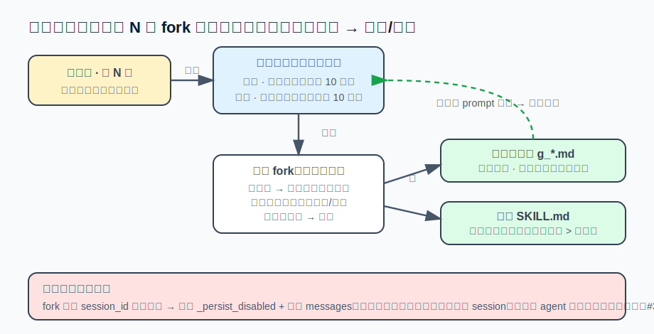

# s17 · 自进化复盘环

大多数 agent 的记忆是「你手动写、它被动读」。有没有可能反过来——让 agent 自己在每次
对话后复盘一遍：这次学到的东西里，哪些跨会话仍然成立？把它们主动沉淀进记忆和技能，
下次开局就已经知道。这就是 hermes-agent 的「闭环学习」的核心一环：**每 N 轮 fork 一个
受限的自己，蒸馏刚才的对话，写进记忆和技能**。

技术上它复用了本系列几乎所有旧机制——s09 的 subagent、s07 的 prompt cache、s08 的持久化——
但把它们拧成了一个新形状：一个「不阻塞主对话、不污染主会话、几乎不额外花钱」的后台蒸馏器。
本章逐笔核算三个关键决定：**跑多勤**（节奏）、**谁来蒸馏**（模型 + 缓存）、**怎么不污染**（隔离）。
与 s16 相反，这一章的「真实产品对照」结论是：评估之后，**移植了——但是简化版**。



## 运行演示（不需要 API key）

```sh
node s17_self_evolution/demo.mjs
```

三笔账，真实运行输出：

```
━━━ 账一：两条独立节奏（记忆按轮 · 技能按工具迭代） ━━━
  轮 3 · 5次工具  → 复盘[技能]
  轮 4 · 1次工具  → 复盘[记忆]
  轮 7 · 8次工具  → 复盘[技能]
  轮 8 · 0次工具  → 复盘[记忆]
  12 个用户轮、26 次工具迭代 → 记忆复盘 3 次、技能复盘 3 次
  → 重工具轮（轮7 的 8 次）单轮就把技能计数器顶过阈值；记忆则只认轮数，与工具量无关。

━━━ 账二：谁来蒸馏 —— 同模型全量重放 vs 换便宜模型 digest 重放 ━━━
  完整对话：91 条 · 26799 tok
  同模型（默认，routed=false）：全量重放 26799 tok —— 但全在热缓存里，≈按 0.1 折的 cache 读
  换便宜模型（routed=true）：缓存凉了，改 digest —— 尾 24 条原文 + 更早 67 条塌成摘要
    digest 冷写：7604 tok（vs 全量冷写 26799 tok，省 72%）

━━━ 账三：fork 共享 session —— 未隔离（中毒） vs 持久化隔离（干净） ━━━
  未隔离：主 session 5 条，下一轮 agent 以为用户最后说的是：
          "复盘上面的对话……" ❌ 于是变身复盘器，丢下登录 bug
  隔离后：主 session 3 条，下一轮 agent 看到的仍是：
          "帮我修复登录 bug" ✅ 复盘只写记忆/技能文件，一个字都不进主对话
```

三个决定，三笔账。下面逐个拆。

## 设计：三个关键决定

### ① 跑多勤：两条独立节奏，不是「每轮都复盘」

最直觉的实现是每轮结束都复盘一次——但那是账单乘法器（每轮多一次全上下文推理）。
hermes 用**两个不同的计数器**，各自到点才触发：

- **记忆复盘**按**用户轮数**（`_turns_since_memory`，默认每 10 轮）。「用户是谁、偏好什么」
  这种信号随对话深度累积，按轮数触发合理。
- **技能复盘**按**工具迭代数**（`_iters_since_skill`，累计 10 次工具调用）。账一里轮 7 一轮用了
  8 次工具，单轮就几乎把技能计数器顶过阈值——因为**一轮里跑了很多工具 = 干了真活 =
  大概率产出了值得记的技术**。而空聊的轮（轮 2、5、8 的 0 次工具）不推进技能计数器。

这个不对称是刻意的：记忆看「聊了多久」，技能看「干了多少活」。触发后还要过一道闸：
**只在回复已交付、没被打断时才 fork**——复盘绝不和用户的任务抢模型注意力。

### ② 谁来蒸馏：同模型吃热缓存，换模型才 digest

复盘 = fork 一个 agent（s09 的 subagent 机制）重放对话、写记忆/技能。核心的省钱决定是
**默认用同一个模型**：主对话刚跑完，整段 transcript 还在 prompt cache 里是热的（s07），
同模型全量重放 = 廉价的 cache 读，不是冷写。为了命中缓存前缀，fork 把 system prompt、
`session_id`、`tools[]` 全部和父**逐字节对齐**（s07 讲过前缀差一个字节就击穿）——官方实测
端到端降本约 26%。

只有当用户主动把复盘**路由到一个不同的（更便宜的）模型**时，缓存才会凉。这时账二的
digest 才登场：最近 24 条原文保留，更早的每条塌成一行摘要（`USER:≤300` / `ASSISTANT[tools]`），
把冷写从 26799 压到 7604 tok（省 72%）。

**注意这里的因果**：digest 不是「省钱魔法」，它只是**换模型丢了热缓存之后的止损**。默认路径
（同模型）根本不 digest，因为热缓存比任何摘要都便宜。这也回答了标题的问题——「用另一个 AI
蒸馏」这个说法对一半：是第二次独立推理没错，但那个 fork 默认就是**你自己**，不是一个更小的
专用蒸馏器。

### ③ 怎么不污染：共享 session_id 的必付账单

fork 为了吃热缓存共享了父的 `session_id`——这带来一个隐蔽的灾难。账三演示：如果不禁持久化，
fork 会把「复盘上面的对话」这句 harness 指令 + 自己的回复**写进用户真实 session**（s08 的
event log）。下一轮主 agent 回放历史，读到这条 user 消息，把它当成**站着的指令** → 直接变身
复盘器，拒绝干用户真正要的活（hermes 真实事故 #38727）。

所以隔离不是可选优化，是共享 session_id 的必付账单。hermes 用五道防线，最关键的两道：
`_persist_disabled=True`（fork 的一切写入不落主 session 的 DB）和**独立的 messages 数组**。
外加：不碰外部记忆插件、禁止压缩（s06，否则 fork 赢了压缩竞争会把父轮换成孤儿会话）、
危险命令审批自动 deny（s13，避免和主 TUI 的输入死锁）。

## 接进真实 agent

挂载点选在 **turn 结束的钩子**：主循环（s01）跑完一轮、flush 完状态之后，调一个
`maybeSelfEvolve()`——它自增计数器、到点就 `void runSelfEvolveReview()` 后台跑，用 s09 学过的
fire-and-forget 模式（`.catch(reportBackgroundError)`），永不阻塞当前轮。三条守卫缺一不可：
`isSubagent` 挡掉递归（fork 自己也跑 runTurn，不挡会无限复盘）、`enabled` 开关、`inFlight`
防止两次复盘叠在一起。

复盘的**指令内容**做成一份可编辑文件（而不是硬编码）：首次自动播种默认版，之后归用户，
每次复盘现读——改完即生效不用重启。工具限制走**受限 profile**（s02 的工具注册表 + 白名单）：
只放 note/read/write 记忆工具 + 文件工具，没有 shell/network，所以后台在「自动批准」模式跑
也安全——白名单本身就是护栏。

## 真实产品对照

完整实现在 hermes-agent 的 `agent/background_review.py`（约 900 行）+ `agent/curator.py`。本章三笔账
全部来自它的实测：`_turns_since_memory` / `_iters_since_skill` 双计数器；`_digest_history` 的
tail=24 摘要；`_persist_disabled` 那道防线的注释里直接写着 #38727 的根因分析。复盘之外它还有
第二个后台环——**curator**：闲时触发（默认 7 天），归档/合并长期没用的技能，防技能库膨胀
（复盘环只管「加」，curator 管「养」）。

这一章的 Reina 对照结论和 s16 相反：**移植了，但砍成核心版**。移植的是那根轴——受限 fork
蒸馏对话写全局记忆本 + 技能，同模型热缓存，五道隔离防线，复盘指令做成可编辑文件（这点
比 hermes 硬编码还前进一步）。**砍掉的**：便宜模型路由 + digest（默认同模型够用，省的是极端
情况的钱）、双节奏拆成单节奏（`everyTurns` 一个旋钮）、curator 技能养护（规模化才需要）、
聊天内通知（落到日志）。

由此得到和 s16 互补的一条经验：s16 是「评估后决定不做」，这章是「评估后决定做核心、砍外围」。
两者是同一个判断力的两面——**先认清一个机制里哪根是轴、哪些是围绕它把成本压到可接受的
辅助设施**，再决定移植哪些。轴（自进化能不能发生）和辅助（长期/规模下好不好用）是两个问题，
可以分开回答。

## 动手挑战

1. 账一的两条计数器目前**独立触发**：同一轮可能同时点燃记忆和技能两次复盘（轮 4/8/12 差一点
   就撞上）。改成：当两条同轮到点时，合并成**一次** fork（用 hermes 的 `_COMBINED_REVIEW_PROMPT`
   思路，一次复盘同时看记忆和技能）。算一算：一个 20 轮、每轮 2-3 次工具的会话，合并前后
   分别 fork 几次？省下的那几次全上下文推理值多少？
2. 账三的隔离只演示了「写不写回主 session」。还有一个更隐蔽的泄漏：fork 如果**读**了主 session
   的外部记忆插件（honcho/mem0），它的 harness prompt 会以「用户说的话」被记进用户画像。
   设计一个开关（提示：hermes 的 `skip_memory=True`），并说明它和 `_persist_disabled` 挡的是
   **两个不同方向**的污染——一个是写出去，一个是读进来又被记下。

---

| [← 上一章：MoA 多模型合议](../s16_moa/README.md) | [目录](../README.md) | 下一章：（连载中） |
|---|---|---|
